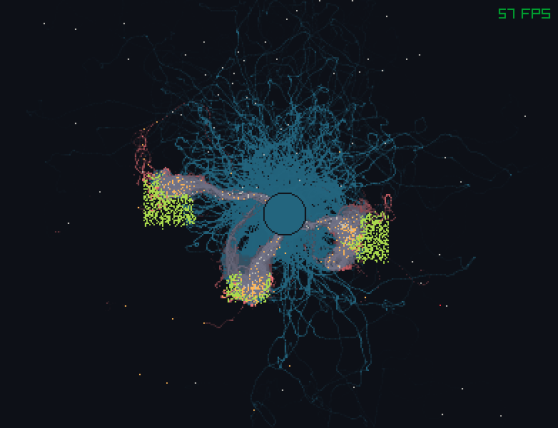

# Ant Simulation

### Rules-
- If the ant does not have food, it will search for it randomly while leaving out pheromones to the base.
- If the ant found food, it will follow back the pheromones to the base and leave pheromones to the food.
- Other ants will follow the 'to food' pheromones.

## Controls

- Left click to add food.
- Right click to add walls.
- Scroll to change brush size.

#

## Screenshot
